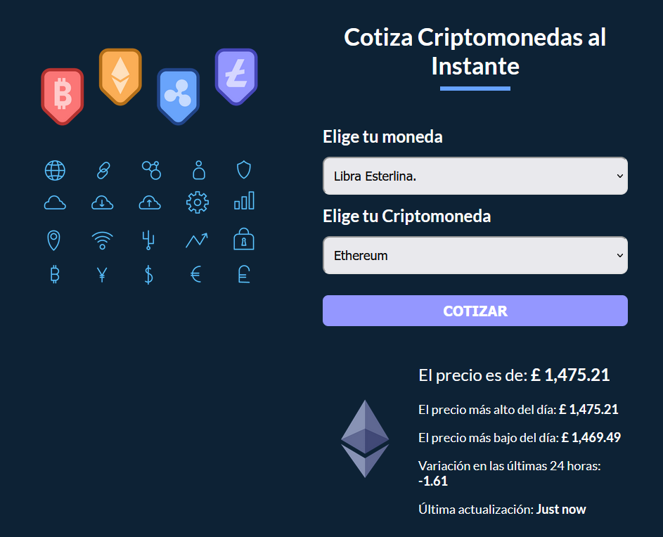

# Cryptocurrency price

React project focused on learning **styled components**.

App to get the current price of the ten most popular cryptocurrencies in any other currency that you need (USD, MXN, EUR, GBP).

All information displayed is by [CryptoCompare](https://min-api.cryptocompare.com)

## Used technologies
* React Js
* Emotion
* Vite

## Highlights
* Custom Hook
* Styled Components